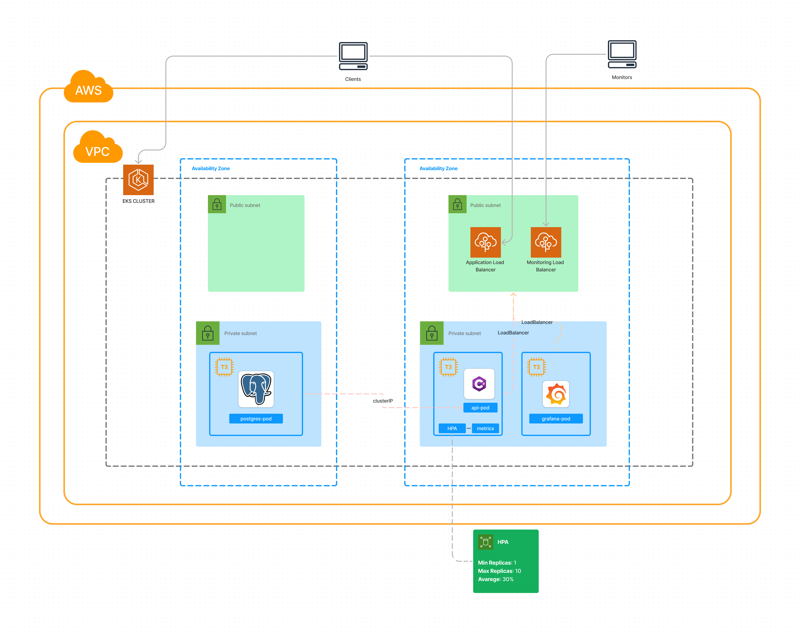

# Tech Challenge FIAP

## Desenho da arquitetura (AWS - EKS)



Link do Figma: </br>
https://www.figma.com/file/Ucj1iHtpaTif7amdmwKUfR/Arquitetura---AWS-Tech-Challenger?type=whiteboard&node-id=0%3A1&t=rP3icHWmtlshkT5Q-1

# Guia de Execução do Kubernetes

Este é um guia passo a passo para executar o Kubernetes e configurar todos os componentes necessários para o seu sistema.

## Clonando o Repositório

1. Clone este repositório em sua máquina local:

    ```
    git clone https://github.com/JonatasAlves9/tech-challenger-fiap.git
    ```

## Configurando a Infraestrutura

1. Navegue até o diretório `infra`:

    ```
    cd TechChallenger/infra
    ```

2. Aplique as configurações do banco de dados:

    ```
    kubectl apply -f database
    ```

3. Obtenha o Cluster IP do banco de dados executando o seguinte comando:

    ```
    kubectl get svc
    ```

4. Edite o arquivo de ConfigMap localizado em `api/tech-challenger-configmap.yaml` e altere o valor de `DB_HOST` para o Cluster IP obtido.

5. Aplique as configurações do ConfigMap:

    ```
    kubectl apply -f api/tech-challenger-configmap.yaml
    ```

6. Aplique as configurações do Deployment da API:

    ```
    kubectl apply -f api/tech-challenger-deployment.yaml
    ```

Agora a API e o banco de dados estão em execução.

## Configurando o Grafana e o Prometheus

1. Navegue até o diretório `infra/monitoring`:

    ```
    cd ../monitoring
    ```

2. Crie um novo namespace para o monitoramento:

    ```
    kubectl create namespace monitoring
    ```

3. Aplique as configurações do Prometheus:

    ```
    kubectl create -f k8s-prometheus/clusterRole.yaml
    kubectl create -f k8s-prometheus/config-map.yaml
    kubectl create -f k8s-prometheus/prometheus-deployment.yaml
    kubectl create -f k8s-prometheus/prometheus-service.yaml --namespace=monitoring
    ```

4. Aplique as configurações do Grafana:

    ```
    kubectl apply -f kube-state-metrics/
    kubectl create -f k8s-grafana/
    ```

Agora o Grafana e o Prometheus estão em execução.

## Configurando a Escalabilidade

1. Navegue até o diretório `api/scaling`:

    ```
    cd ../../api/scaling
    ```

2. Aplique as configurações de métricas:

    ```
    kubectl apply -f metrics.yaml
    ```

3. Aplique as configurações do Horizontal Pod Autoscaler (HPA):

    ```
    kubectl apply -f hpa.yaml
    ```

Agora todo o sistema está configurado e funcionando perfeitamente.

## Importando uma Collection JSON no Postman

Esta sessão descreve os passos necessários para importar uma Collection JSON no Postman a partir de um arquivo local.</br>
Link:    [Tech Challenger.postman_collection.json](https://github.com/JonatasAlves9/tech-challenger-fiap/blob/main/assets/Tech%20Challenger.postman_collection.json)


## Passos

1. **Faça o Download do Postman:**
   - Se você ainda não tem o Postman instalado, faça o download e instale a versão adequada para o seu sistema operacional no [site oficial do Postman](https://www.postman.com/downloads/).

2. **Abra o Postman:**
   - Após a instalação, abra o aplicativo Postman em seu sistema.

3. **Importe a Collection:**
   - No topo da janela do Postman, você verá uma barra de navegação. Clique no botão "Import" (Importar).

4. **Selecione o Arquivo .json:**
   - Uma janela de diálogo será aberta. Navegue até o local onde você tem o arquivo .json da Collection.
   - Selecione o arquivo Tech_Challenger.postman_collection.json.

5. **Confirme a Importação:**
   - Após selecionar o arquivo, o Postman apresentará uma visão geral da Collection que será importada. Certifique-se de que é a coleção correta.

6. **Clique em "Import":**
   - Depois de revisar a Collection, clique no botão "Import" (Importar) para carregar a Collection no Postman.

7. **Localize a Collection:**
   - Agora que a Collection foi importada com sucesso, você pode encontrá-la na barra lateral esquerda do Postman, na seção "Collections" (Coleções).

8. **Execute a Collection (Opcional):**
   - Você pode executar a Collection clicando nela e selecionando o botão "Run" (Executar) no canto superior direito. Isso abrirá o Runner do Postman, onde você pode configurar as execuções.

9. **Explore e Utilize:**
   - Com a Collection importada, você pode explorar suas solicitações, testes e outras configurações. Sinta-se à vontade para modificar ou adicionar solicitações conforme necessário.

Espero que este guia 

## Projeto
Sistema de pedidos de uma lanchonete de bairro

## Grupo
  - Marlon - RM 352711
  - Zanaro - RM 352692
  - Jônatas - RM 353060
  - Matheus - RM 352813

## Desenvolvimento
  - Acompanhamento (Click Up): https://app.clickup.com/9017094286/v/b/8cqbw4e-57
  - Arquitetura (Miro): https://miro.com/app/board/uXjVNQfujpo=/
  - Linguagem: C#
  - Banco de Dados: Postgres
  - Infraestrutura: Containers em Docker
